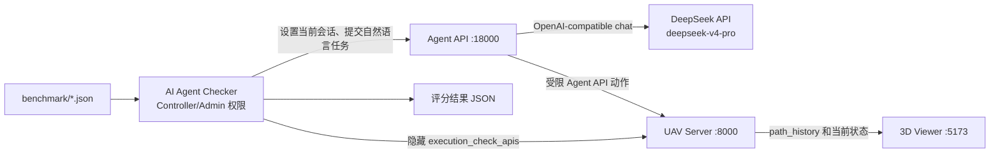

# 使用当前 DeepSeek API 运行 Benchmark 并在 3D Viewer 中回放

本文说明如何在当前仓库中完成以下闭环：

1. 使用 `agent4drone/llm_settings.json` 中当前选中的 DeepSeek 模型执行 Benchmark 任务；
2. 使用 AI Agent Checker 自动提交任务、执行隐藏检查并导出测评结果；
3. 在 Web 3D Viewer 中实时观察任务，并沿 Server 保存的无人机轨迹进行回放。

本文命令面向 Windows PowerShell。仓库根目录为：

```text
C:\Users\Administrator\Desktop\Code\multi_uav_decision
```

> 核对日期：2026-07-13。当前仓库已核对为 `Deepseek API / deepseek-v4-pro / https://api.deepseek.com`。真实 API key 已在本地配置，本文不会显示或复制它。

## 1. 先明确“回放”的含义

当前 3D Viewer 的回放数据来自 UAV Server 当前会话中的：

```text
history.path_history
```

Viewer 的 **Roam / 漫游** 模式会用一架“回放无人机”和追踪相机沿选中无人机的历史路径运动。因此：

- 可以实时观察当前 Benchmark 任务；
- 任务结束后可以回放有移动轨迹的无人机；
- 不会重新调用 DeepSeek，也不会再次执行控制命令；
- `agent_check_results_*.json` 是评分报告，不是 3D 回放文件；
- 纯通信、分配或没有产生位移的任务没有可回放路径；
- Checker 在下一任务前重载同一场景时，会覆盖上一任务的运行态。因此若要保留某个指定任务的回放，建议一次只运行一个任务，或在任务之间暂停并另存会话快照。

推荐分成两种运行方式：

| 目的 | 推荐方式 |
| --- | --- |
| 验证 DeepSeek、Server、Checker 和 3D 回放链路 | 只排队 1 个任务，完成后立即回放 |
| 生成完整 Benchmark 指标 | 排队全部 1500 个任务，开启逐任务场景重载，最后导出结果 |

## 2. 组件和权限关系



| 组件 | 地址 | 所需权限 |
| --- | --- | --- |
| UAV Server | `http://127.0.0.1:8000` | 无 key 时默认为 AGENT；导入/完整状态至少需要 SYSTEM，隐藏 `/check/*` 只允许 ADMIN |
| Agent API | `http://127.0.0.1:18000` | 从本地 `llm_settings.json` 读取 DeepSeek 配置 |
| 3D Viewer | `http://127.0.0.1:5173` | 使用专用 SYSTEM key 只读完整会话和轨迹，不要把 ADMIN key 暴露给浏览器 |
| AI Agent Checker | 本地 Tkinter 程序 | 必须使用 ADMIN 权限执行隐藏检查 |

四类 key 不要混用：

- DeepSeek API key：只用于访问大模型；
- UAV AGENT key：只用于 Agent 执行受限控制动作；留空时 Server 默认为 AGENT 角色；
- UAV SYSTEM key：只供本机 Viewer 读取完整状态；
- UAV ADMIN key：只供 Controller 导入场景并执行隐藏检查，不应进入浏览器。

为了保持 Benchmark 的受限观测条件，不要把 SYSTEM/ADMIN key 填入 Agent 的 `uav_api_key`。该字段应留空，或明确使用 AGENT key。

## 3. 环境和 Benchmark 清单检查

打开 PowerShell，进入仓库并激活项目环境：

```powershell
Set-Location C:\Users\Administrator\Desktop\Code\multi_uav_decision
& "$env:USERPROFILE\miniconda3\shell\condabin\conda-hook.ps1"
conda activate llm_uav_decision
python --version
```

预期 Python 为 3.11。首次安装环境时使用：

```powershell
conda env create -f .\environment.yml
```

核对当前 Benchmark 文件数量：

```powershell
$jsonCount = @(Get-ChildItem .\benchmark -File -Filter *.json).Count
$imageCount = @(Get-ChildItem .\benchmark -File -Filter *.jpg).Count
"JSON=$jsonCount, JPG=$imageCount"
```

当前应得到：

```text
JSON=75, JPG=75
```

当前锁定的 `cross-env 10.1.0` 要求 Node.js 20 或更新版本：

```powershell
node --version
npm --version
```

这 75 个会话共包含 1500 个自然语言任务，覆盖：

- `Target_Assignment`：25 个会话；
- `Area_Search`：25 个会话；
- `Area_Assignment_and_Patrol`：25 个会话；
- `Easy`、`Intermediate`、`Moderate`、`Hard`、`Extreme` 五档难度。

## 4. 核对当前 DeepSeek 配置

必须从 `agent4drone` 目录启动 Agent API，因为服务以相对路径读取 `llm_settings.json`。

以下命令只显示非敏感配置，不输出 key：

```powershell
Set-Location C:\Users\Administrator\Desktop\Code\multi_uav_decision\agent4drone
$cfg = Get-Content .\llm_settings.json -Raw -Encoding UTF8 | ConvertFrom-Json
$provider = $cfg.provider_configs.PSObject.Properties[$cfg.selected_provider].Value
[pscustomobject]@{
    SelectedProvider = $cfg.selected_provider
    Type             = $provider.type
    BaseUrl          = $provider.base_url
    Model            = $provider.default_model
    ApiKeyConfigured = -not [string]::IsNullOrWhiteSpace([string]$provider.api_key)
}
```

当前预期为：

```text
SelectedProvider : Deepseek API
Type             : openai-compatible
BaseUrl          : https://api.deepseek.com
Model            : deepseek-v4-pro
ApiKeyConfigured : True
```

如果本地尚无 `llm_settings.json`，先复制模板，再只修改本地副本：

```powershell
Copy-Item .\llm_settings.example.json .\llm_settings.json
```

DeepSeek Provider 的关键字段应为：

```json
{
  "selected_provider": "Deepseek API",
  "provider_configs": {
    "Deepseek API": {
      "type": "openai-compatible",
      "base_url": "https://api.deepseek.com",
      "requires_api_key": true,
      "api_key": "<不要提交到 Git>",
      "default_model": "deepseek-v4-pro"
    }
  }
}
```

若希望通过环境变量提供 key，必须先把该 Provider 的 `api_key` 留空，然后在**启动 Agent API 的同一个 PowerShell** 中设置 `OPENAI_API_KEY` 或 `LLM_API_KEY`。当前实现不读取 `DEEPSEEK_API_KEY`，也不会自动加载 `.env`。

不回显 key 的 PowerShell 写法：

```powershell
$secureKey = Read-Host "DeepSeek API key" -AsSecureString
$env:LLM_API_KEY = [System.Net.NetworkCredential]::new("", $secureKey).Password
Remove-Variable secureKey
```

key 的实际优先级是：

```text
llm_settings.json 中的 api_key > OPENAI_API_KEY > LLM_API_KEY
```

配置改动只有在重启 Agent API 后才生效。

### 关于任务间记忆

当前配置启用了：

```json
"share_blackboard_by_session": true
```

这表示同一会话内的命令可共享 Agent 黑板。复现当前配置时保持该值不变；若实验协议要求每个自然语言任务的 Agent 记忆也完全独立，应改为 `false`、重启 Agent API，并在实验报告中明确记录这一差异。

## 5. 启动四个组件

建议使用四个 PowerShell 窗口。每个 Python 窗口都需要激活 `llm_uav_decision`。若新窗口中不能直接执行 `conda activate`，先运行第 3 节的 `conda-hook.ps1` 命令。

### 5.1 窗口 1：UAV Server

```powershell
Set-Location C:\Users\Administrator\Desktop\Code\multi_uav_decision\server
conda activate llm_uav_decision
python main.py --api-only --host 127.0.0.1 --port 8000
```

另开 PowerShell 检查：

```powershell
Invoke-RestMethod http://127.0.0.1:8000/version
```

### 5.2 窗口 2：Agent API

```powershell
Set-Location C:\Users\Administrator\Desktop\Code\multi_uav_decision\agent4drone
conda activate llm_uav_decision
python -m uvicorn agent_api_service:app --host 127.0.0.1 --port 18000
```

不要直接用 `python agent_api_service.py` 做局域网环境下的测评：该入口会监听 `0.0.0.0:18000`，而 Agent API 本身没有请求认证，可能被同网段设备提交命令并消耗模型额度。上面的 Uvicorn 命令只绑定本机回环地址。

检查服务状态：

```powershell
Invoke-RestMethod http://127.0.0.1:18000/health
```

预期至少为：

```text
status            : active
agent_initialized : True
```

`/health` 当前不会返回具体模型名。模型应以启动控制台中的以下日志为准：

```text
Initializing Agent with Provider: Deepseek API, Model: deepseek-v4-pro
```

也可在 `agent4drone` 目录查询最新日志：

```powershell
$log = Get-ChildItem .\logs\agent4drone_agent_api_service_*.log |
    Sort-Object LastWriteTime -Descending |
    Select-Object -First 1
Select-String -Path $log.FullName -Pattern "Initializing Agent with Provider" |
    Select-Object -Last 1
```

当前本地历史日志已经出现过 DeepSeek `/chat/completions` 的 HTTP 200，说明该配置曾成功连通；这不能保证当前 key、额度或网络仍可用，必须以第 6 节的本次 smoke test 为准。

### 5.3 窗口 3：3D Viewer

Viewer 必须用 SYSTEM 或更高权限读取 `/sessions/current/data`；否则会收到 403 并回退到本地 Demo Mission。由于 key 会进入浏览器，实际操作只使用专用 SYSTEM key，不要使用 ADMIN key。

按 [Server 身份认证说明](../server/docs/AUTHENTICATION.md) 使用本机 SYSTEM key。仅在当前 PowerShell 中输入，不要写进 Markdown、提交记录或公开前端配置：

```powershell
Set-Location C:\Users\Administrator\Desktop\Code\multi_uav_decision\view3d
$viewerKey = Read-Host "本机 UAV SYSTEM key" -AsSecureString
$env:VITE_API_KEY = [System.Net.NetworkCredential]::new("", $viewerKey).Password
$env:VITE_API_BASE_URL = "http://127.0.0.1:8000"
Remove-Variable viewerKey

# 首次安装或 package-lock.json 更新后执行一次
npm ci

npm run dev
```

浏览器打开：

```text
http://127.0.0.1:5173
```

注意：`VITE_` 环境变量会进入浏览器端，因此 Viewer 只应绑定在本机 `127.0.0.1`，不要把带特权 key 的开发服务发布到局域网或公网。更换 key 后必须重启 Vite。

### 5.4 窗口 4：Session Manager / AI Agent Checker

```powershell
Set-Location C:\Users\Administrator\Desktop\Code\multi_uav_decision\controller
conda activate llm_uav_decision
python main.py
```

在 Session Manager 中完成以下设置：

1. 点击 `Settings`；
2. 将 `Session Storage` 选择为绝对路径 `C:\Users\Administrator\Desktop\Code\multi_uav_decision\benchmark`；
3. 确认 `UAV API Base URL` 为 `http://127.0.0.1:8000`；
4. 确认 `Agent API Base URL` 为 `http://127.0.0.1:18000`；
5. `API Secret Key` 留空即可使用项目内置的本地 ADMIN 身份；隐藏 `/check/*` 不接受 SYSTEM 身份；
6. 保存设置，必要时关闭后重新打开 Controller；
7. 点击 `CheckUI` 打开 AI Agent Checker。

`controller/settings.json` 已受 Git 跟踪，不能在其中保存真实自定义 key。若确需覆盖默认 ADMIN key，必须把该文件作为仅本机敏感配置处理，并确保其改动绝不提交。无论如何都不能填写 DeepSeek key。

也可直接启动 Checker：

```powershell
Set-Location C:\Users\Administrator\Desktop\Code\multi_uav_decision\controller
python .\check_ui\run_agent_checker.py
```

但首次配置 Benchmark 路径时，使用 Session Manager 的 `Settings` 更直观。

## 6. 先执行一个可回放的任务

不要一开始就运行全部 1500 个任务。先用一个会产生无人机移动的 Easy 任务验证链路。

在 AI Agent Checker 中：

1. 点击 `Refresh Sessions`；
2. Checker 会自动导入 `benchmark` 目录中的 JSON；
3. 在左侧 Sessions 列表中滚动并选择一个 Easy 会话，例如 `Area Assignment and Patrol Easy 1`；
4. 会话选中后，可用 Filter 筛选任务树，再选择一个明确要求起飞、移动、搜索或巡逻的任务；
5. 点击 `Add Selected to Queue`；
6. 确认队列里只有这个任务。

推荐选项：

| Checker 选项 | 单任务/完整测评建议 | 原因 |
| --- | --- | --- |
| `Reload session before each task` | 开启 | 每个任务应从原始 Benchmark JSON 状态开始 |
| `Force land all drones before each task` | 关闭 | 当前 Benchmark 初始无人机已经全部为 `idle`，额外动作还可能污染历史检查 |
| `Force charge all drones before each task` | 关闭 | 当前 Benchmark 初始电量已经全部为 100，额外动作还可能污染历史检查 |
| `Random send one of the commands` | 关闭 | 固定使用任务主描述，便于复现 |
| `Skip already checked tasks` | 首次运行可开启；重跑时关闭 | 防止重跑目标任务被跳过 |
| `Agent Timeout (s)` | `500` | 使用当前 Checker 默认值 |
| `Wait before start (s)` | `0` | 不额外等待 |

点击 `Start` 后，Checker 会依次：

1. 从 JSON 重载会话；
2. 将该会话设置为当前会话；
3. 读取任务的主自然语言描述；
4. 发送到 Agent API；
5. Agent 调用当前 DeepSeek 模型规划并通过受限 UAV API 执行动作；
6. Checker 使用特权角色执行 `execution_check_apis`；
7. 显示任务通过状态和检查通过数。

Reload 失败时，当前 Checker 只记录 WARNING 并继续，不会自动中止。正式测评必须观察日志中的 `Session reloaded successfully`；若出现 `WARNING: Failed to load file`、ID mismatch、覆盖失败或缺少源文件，应立即停止该批次，修复后重新运行。

Agent 不应直接读取 Benchmark JSON 或隐藏检查。JSON 的导入和隐藏验证由 Controller 完成，Agent 只通过平台允许的 API 观察和行动。

## 7. 在 3D Viewer 中回放

为了防止下一任务重载并覆盖当前轨迹，最稳妥的方法是只排队一个任务。若队列中已有多个任务，可在当前任务执行期间点击 `Pause`；暂停会在当前任务结束后、下一任务开始前生效。

任务结束后：

1. 等待最多约 3 秒，让 Viewer 获取最后一次 Server 状态；
2. 点击底部 `Live / 实时`，切换为 `Paused / 已暂停`，冻结当前会话快照；
3. 左键选择一架执行过移动的无人机；
4. 可选：反复点击 `Trail / 轨迹`，直到显示 `Trail: All / 轨迹: 全部`，便于同时查看完整轨迹线；Roam 本身始终读取完整路径，不依赖该显示选项；
5. 点击顶部 `Roam / 漫游`，或按数字键 `4`；
6. Viewer 会显示回放无人机，并用追踪相机沿完整路径播放；
7. 按 `.` 加速，按 `,` 减速；速度范围为 25%～400%；
8. 回放完成后若要重播，先退出 `Roam`，再重新点击 `Roam`。

`Live / 实时` 只停止 Viewer 后续的 3 秒轮询，不会暂停 Agent、UAV Server、Checker，也不会暂停已经开始的 Roam 动画。

其他常用快捷键：

- `1`：适配全景；
- `2`：顶视图；
- `3`：跟随当前真实位置；
- `4`：沿历史路径回放；
- `Esc`：取消选择；
- `L`：显示或隐藏标签；
- `M`：显示或隐藏小地图。

如果提示“该无人机没有可漫游路径”，通常表示：

- 选中的无人机没有移动；
- 当前任务只执行了通信或分配；
- Viewer 在任务结束前就切换成了 Paused；
- Checker 已经重载下一任务；
- Viewer 因 403 或 Server 不可用而显示的是 Demo Mission。

可在设置了专用 SYSTEM key 的 PowerShell 中检查当前路径点数：

```powershell
$headers = @{ "X-API-Key" = $env:VITE_API_KEY }
$state = Invoke-RestMethod `
    -Uri "http://127.0.0.1:8000/sessions/current/data" `
    -Headers $headers
$state.history.path_history.PSObject.Properties |
    ForEach-Object { "{0}: {1} points" -f $_.Name, @($_.Value).Count }
```

## 8. 运行完整 Benchmark

单任务链路验证成功后再运行全量测评：

1. 若 Server 中只有这批 Benchmark 会话，在 Checker 的 Session 列表中点击第一项，再按住 `Shift` 点击最后一项，以连续选中 75 个会话；
2. 点击 `Add Tasks in Sessions`，将这些会话的全部任务直接加入队列；
3. 队列任务总数应为 1500；
4. 使用第 6 节的推荐选项，尤其要开启 `Reload session before each task`；
5. 点击 `Start`；
6. 运行期间可用 `Pause / Resume / Stop` 控制；
7. 全部完成后点击 `Export Results`，保存 `agent_check_results_*.json`。

Checker 的 Filter 只筛选任务树，不筛选左侧 Session 列表。若 Server 中还存在示例或自建会话，不要用首尾 `Shift` 把它们一起选入；应使用 `Ctrl` 精确多选 Benchmark 会话，或在单独的干净 Server 进程中运行正式测评。无论采用哪种方式，都以队列恰好为 1500 个任务为准。

全量运行是串行流程。按每个任务 500 秒超时计算，理论最坏情况可超过 208 小时，并会产生显著的 DeepSeek API 调用量。建议按场景类型或难度分批运行、分批导出，并先确认账户额度和服务限流策略。

导出结果中重点检查：

```text
statistics.total_tasks
statistics.passed_tasks_count
statistics.failed_tasks_count
statistics.total_checks
statistics.passed_checks
statistics.task_pass_rate
statistics.average_check_pass_rate
statistics.check_pass_rate
results[]
```

完整队列正常时：

```text
statistics.total_tasks = 1500
statistics.total_checks = 9396
```

如果运行被停止，当前实现会从导出中直接省略尚无结果的任务，而不是把它们计为失败。因此中断后的 `total_tasks` / `total_checks` 会小于 1500 / 9396，不能作为完整 Benchmark 结果；正式统计前必须同时核对这两个总数。

建议同时记录以下运行元数据：

- Git commit：`git rev-parse HEAD`；
- 日期和时区；
- Provider、Base URL、模型名；
- `share_blackboard_by_session`；
- Checker 重载、随机别名、强制降落/充电和超时设置；
- Server `/version` 输出；
- 运行的会话数、任务数和检查数。

## 9. 保留以后可回放的任务快照

当前 Checker 的评分 JSON 不包含 3D 路径，Viewer 也不能直接打开该评分 JSON。若要在关闭服务后继续回放某个任务，需要另存包含 `history.path_history` 的会话快照。

推荐流程：

1. 一次只执行一个要保留的任务；
2. 等待这个单任务队列运行完成；
3. 关闭 Checker 窗口，使被隐藏的 Session Manager 主窗口重新出现；
4. 在 Session Manager 中点击 `Refresh`；
5. 选择刚执行的当前会话并点击 `Export`；
6. 文件名中加入任务 ID 和模型名，例如 `fb8971ec__task-id__deepseek-v4-pro.json`；
7. 以后通过 Session Manager 的 `Import` 导入该快照；Import 会创建一个新的会话 ID；
8. 选择新导入的会话并执行 `Launch`，或用 `Set current` 将其设为当前会话；
9. 打开 Viewer，选择无人机并进入 `Roam`。

从 Session Manager 打开 CheckUI 时，主窗口会暂时隐藏，因此不能在 Checker 仍打开时直接点击 Session Manager 的 Export。单任务运行完成后先关闭 Checker，不会影响 Server 中已经保存的路径历史。

完整测评模式下，`Reload session before each task` 会使同一会话只保留最近一次执行后的运行态。当前仓库不会自动为 1500 个任务逐一生成 3D 快照；若要求每个任务都可离线回放，需要额外实现“每任务结束后导出会话状态”的批处理功能。

### 可选：保存 Agent 工具链

如需审计 DeepSeek 规划和 UAV API 调用，可在 `llm_settings.json` 中启用：

```json
"toolchain_json_recording": true
```

重启 Agent API 后，记录会写入：

```text
agent4drone/logs/toolchains/*.json
agent4drone/logs/toolchains/*_request_history.jsonl
```

这些文件用于审计和命令级复现，不是 3D Viewer 的输入；3D Viewer 仍然依赖会话中的 `history.path_history`。

## 10. 常见问题

### Viewer 显示 Demo Mission，而不是 Benchmark

依次检查：

1. UAV Server 是否在 8000 端口运行；
2. 是否已经导入并设置当前 Benchmark 会话；
3. `VITE_API_BASE_URL` 是否在启动 Vite 前设置；
4. `VITE_API_KEY` 是否为专用 SYSTEM key；
5. 浏览器请求 `GET /sessions/current/data` 是否为 200，而不是 403/404。

### Agent 健康检查成功，但实际没有调用当前 DeepSeek 模型

`/health` 只表示 Agent 已初始化。检查 Agent 启动日志中的 Provider 和 Model；修改 `llm_settings.json` 后必须重启 Agent API。

### 设置了 `DEEPSEEK_API_KEY` 仍提示缺少 key

当前代码不读取该变量。使用 `OPENAI_API_KEY` 或 `LLM_API_KEY`，并确保 Provider 配置中的 `api_key` 为空；若配置文件中已有 key，它优先于环境变量。

### Checker 中没有 75 个 Benchmark 会话

确认 `Session Storage` 使用绝对路径：

```text
C:\Users\Administrator\Desktop\Code\multi_uav_decision\benchmark
```

然后重新打开 Checker 并点击 `Refresh Sessions`。Server 中若还有示例或自建会话，列表总数可能大于 75，应按名称在左侧 Sessions 列表中只选择 Benchmark 会话；Filter 不能过滤该列表。

### 后一个任务受前一个任务状态影响

开启 `Reload session before each task`。该选项重置仿真会话状态；如果还要求 Agent 记忆完全独立，再将 `share_blackboard_by_session` 设为 `false` 并重启 Agent API。

### `Unexpected UTF-8 BOM`

将 `agent4drone/llm_settings.json` 保存为 UTF-8 无 BOM：

```powershell
$path = Resolve-Path .\agent4drone\llm_settings.json
$content = Get-Content $path -Raw -Encoding UTF8
[System.IO.File]::WriteAllText($path.Path, $content, [System.Text.UTF8Encoding]::new($false))
```

### 端口被占用

```powershell
Get-NetTCPConnection -State Listen |
    Where-Object LocalPort -in 8000, 18000, 5173 |
    Select-Object LocalAddress, LocalPort, OwningProcess
```

不要重复启动已经运行的服务；配置变化时先正常停止旧进程，再启动新进程。

## 11. 最小执行清单

- [ ] `benchmark` 下有 75 个 JSON 和 75 个 JPG；
- [ ] 当前 Agent 日志显示 `Deepseek API / deepseek-v4-pro`；
- [ ] UAV Server `/version` 可访问；
- [ ] Agent API `/health` 显示已初始化；
- [ ] Viewer 的 `/sessions/current/data` 请求返回 200，而非 Demo/403；
- [ ] Controller 的 Session Storage 指向 `benchmark` 绝对路径；
- [ ] 先用一个会移动的 Easy 任务完成 smoke test；
- [ ] Checker 开启逐任务 Reload，关闭额外降落、充电和随机别名；
- [ ] 单任务结束后冻结 Viewer，选择无人机并点击 Roam；
- [ ] 全量队列为 1500 个任务，完成后导出评分 JSON；
- [ ] 需要长期回放的任务另行导出包含路径历史的会话快照。
