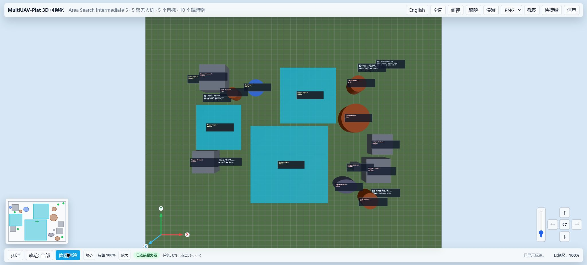
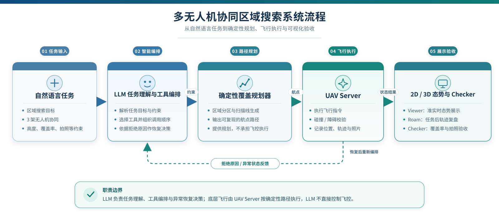
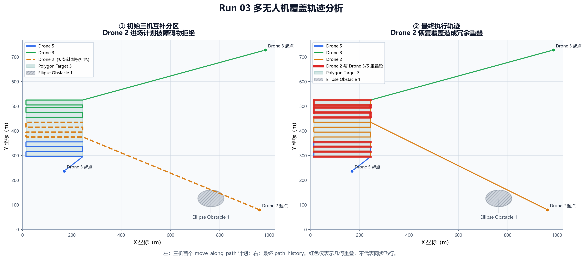
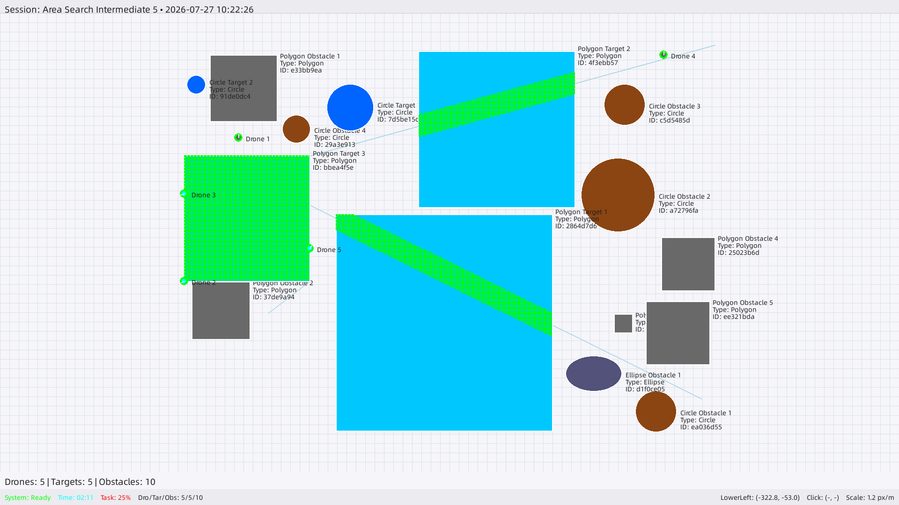
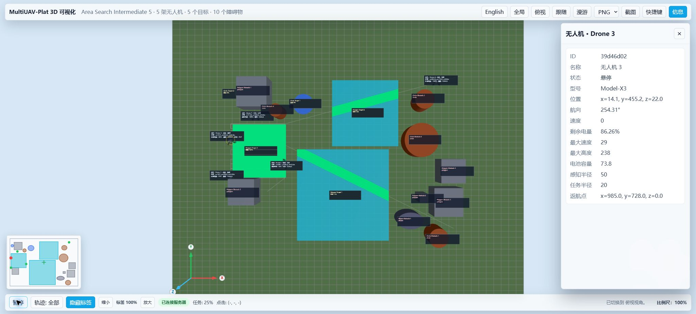
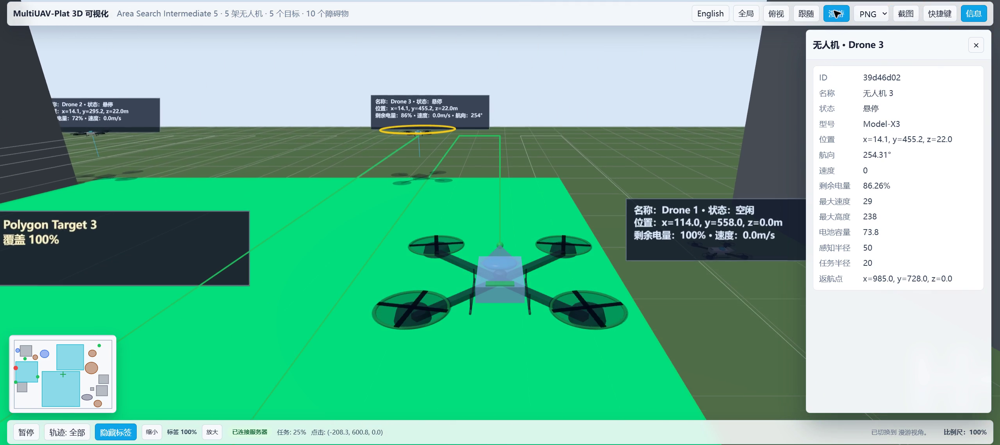

# Area Search Intermediate 5 多无人机协同区域搜索 Demo 验证报告（任务 efabb634）

| 报告项 | 内容 |
|---|---|
| 报告日期 | 2026-07-27 |
| 验证对象 | Area Search Intermediate 5 / 任务 `efabb634` |
| 参演无人机 | Drone 5、Drone 3、Drone 2 |
| 目标区域 | Polygon Target 3 |
| 验证轮次 | 3 次 |
| 总体结论 | **按当前 Checker 验收口径，任务目标已达成；系统具备遇障拒绝后的恢复能力；编队与路径质量仍需优化。** |

> **结论摘要：** 三次演练全部通过 Checker，合计 12/12 项检查通过；Polygon Target 3 三次均达到 100% 覆盖，每架无人机每轮均完成 1 次拍照。Run 03 中 Drone 2 的初始进场路径被障碍物拒绝后，系统通过重新规划完成任务，验证了异常恢复闭环。同时，恢复路径产生了较明显的冗余覆盖，因此本报告不将全程 20 米机间距、真实同步时序或低重叠编队质量判定为已经验证。

本报告以三轮最终结果 JSON、Checker 最终结果以及 Run 03 的 2D、3D 和 Roam 证据为依据。时间数据采用“首个有效动作”和“任务完成”的相对耗时，不采用中间状态字段或 Session 总存续时间。

---

## 1. 执行摘要

本次验证面向“三架无人机协同搜索 Polygon Target 3”的演示任务，重点考察自然语言任务理解、覆盖路径生成、飞行执行、异常恢复、拍照留证、态势展示和结果验收的完整链路。

| 验证维度 | 验证结果 | 结论 |
|---|---:|---|
| Checker 整体通过率 | 3/3 轮 | 通过 |
| Checker 检查项 | 12/12 项 | 全部通过 |
| Polygon Target 3 覆盖率 | 三轮均为 100% | 高于 85% 验收门槛 |
| 拍照任务 | 三轮共 9 张；每架每轮 1 张 | 满足每机至少 1 张要求 |
| 演示响应 | 平均首动作 44.6 秒 | 满足 120 秒阈值 |
| 演示完成 | 平均完成 162.3 秒 | 满足 300 秒阈值 |
| 异常恢复 | Drone 2 遇障拒绝后完成恢复规划 | 恢复闭环有效 |
| 编队与路径质量 | Drone 2 恢复路径存在冗余覆盖 | 有待优化 |

综合三轮结果可以确认：系统已能够将自然语言任务转化为多机搜索行动，并在飞行路径被拒绝时继续完成覆盖与拍照目标。当前 Checker 的四项验收条件均得到稳定满足，能够支撑本阶段功能演示。

需要同步说明的是，任务原始描述中的“20 米间距”和“同步搜索”属于更高层次的编队质量要求，当前验收器尚未对其进行时间序列级校验。现有结果能够证明三机任务态势可在同一场景中展示、目标覆盖与拍照结果达标，但不能据此证明三架无人机在整个过程中始终维持精确间距并按统一时间轴同步运动。

---

## 2. 场景与任务目标

任务 `efabb634` 的业务目标是：由 Drone 5、Drone 3 和 Drone 2 起飞至 22 米，对 Polygon Target 3 执行三机平行搜索；任务描述期望机间距为 20 米，并要求三机在搜索过程中分别拍照。

| 项目 | 任务要求 | 本次证据 |
|---|---|---|
| 场景规模 | 5 架无人机、5 个目标、10 个障碍物 | 三轮初始场景一致 |
| 执行单元 | Drone 5、Drone 3、Drone 2 | 三机均参与三轮演练 |
| 飞行高度 | 22 米 | Run 03 三机末态高度均为 22 米 |
| 目标区域 | Polygon Target 3 | 三轮最终覆盖率均为 100% |
| 覆盖门槛 | 不低于 85% | 三轮均超过门槛 |
| 拍照要求 | 每架无人机至少 1 张 | 每架每轮均为 1 张 |
| 编队期望 | 平行搜索、20 米间距、同步推进 | 属于任务意图；当前 Checker 未做时序与间距校验 |

*图 1　Run 03 初始 3D 态势。该画面用于说明任务区域、障碍物和三架参演无人机的初始空间关系。*

本次报告将“Checker 明确检查的覆盖率与拍照结果”和“任务描述中的编队质量期望”分开表述：前者形成正式通过结论，后者作为当前能力边界与后续优化方向披露。

---

## 3. LLM、覆盖规划器、UAV Server、Viewer、Checker 的职责关系

*图 2　从自然语言任务到执行、展示和验收的职责链路。*

系统由五类核心能力共同构成：

1. **LLM 任务编排与恢复决策**  
   解析自然语言任务，识别无人机、目标区域、飞行高度、覆盖和拍照要求；组织工具调用，并在命令被拒绝后选择恢复策略。

2. **确定性覆盖规划器**  
   将目标多边形和分区约束转换为可执行的往复式覆盖航线。初始阶段为三架无人机生成互补分区，减少同一区域内的重复搜索。

3. **UAV Server 执行与碰撞检测**  
   接收起飞、沿路径移动和拍照命令，维护无人机状态与轨迹；当路径与障碍物冲突时拒绝执行，避免将不可行航线直接写入飞行过程。

4. **Viewer 态势展示**  
   在 2D/3D 场景中展示无人机位置、目标覆盖和历史轨迹，并提供任务完成后的 Roam 轨迹复盘。Viewer 是观察界面，不承担任务判定。

5. **Checker 结果验收**  
   在任务执行后按预设规则检查 Polygon Target 3 覆盖率，以及 Drone 5、Drone 3、Drone 2 的拍照数量；四项条件采用 AND 关系，全部满足后任务才判定通过。

上述分工将“任务理解—路径生成—安全执行—态势观察—结果验收”串联为闭环。此次异常场景也说明，UAV Server 的拒绝结果能够重新进入 LLM 决策链路，而不是直接中断整个任务。

---

## 4. 初始分区、遇障拒绝、恢复规划、覆盖与拍照的执行过程

本次演练的典型执行过程可归纳为以下五个阶段：

1. **任务解析与资源绑定**  
   系统识别三架指定无人机、22 米飞行高度、Polygon Target 3、覆盖搜索和逐机拍照要求。

2. **三机初始分区与路径生成**  
   覆盖规划器将目标区域拆分为三条互补作业带，为 Drone 5、Drone 3 和 Drone 2 分别生成覆盖路线。该策略的目标是让三机承担不同区域，降低重复航程。

3. **路径执行与安全拒绝**  
   Drone 2 的初始进场路径与 Ellipse Obstacle 1 发生冲突，UAV Server 拒绝该路径。拒绝发生在路径执行入口，体现了碰撞检测对不可行航线的阻断作用。

4. **LLM 恢复规划**  
   收到拒绝结果后，LLM 为 Drone 2 重新生成单机全区域覆盖计划。该策略优先保障任务可完成性，使 Drone 2 最终完成搜索与拍照，但也引入了较长的重复覆盖航段。

5. **覆盖完成、拍照与验收**  
   三架无人机分别完成拍照，Polygon Target 3 达到 100% 覆盖；Checker 的四项条件全部通过。

*图 3　Run 03 轨迹分析。左侧展示三机初始互补分区；右侧展示 Drone 2 遇障后的全区域恢复路线。不同颜色代表不同无人机，红色用于标示重复覆盖较集中的航段，并标注 Ellipse Obstacle 1。红色重合段不影响当前 Checker 的通过结果，但揭示了后续路径质量优化空间。*

该过程验证了“安全拒绝—重新决策—继续执行—最终验收”的恢复闭环。与此同时，恢复策略从“局部补缺”退化为“单机重扫全区”，说明系统当前更偏向任务完成保障，尚未充分兼顾多机分工连续性、航程经济性和编队一致性。

---

## 5. 四项 Checker 验收结果

当前任务的 Checker 使用四项 AND 条件：目标区域覆盖率不低于 85%，以及三架无人机分别至少拍摄 1 张照片。

| 序号 | 检查项 | 验收条件 | Run 01 | Run 02 | Run 03 |
|---:|---|---|---:|---:|---:|
| 1 | Polygon Target 3 搜索覆盖率 | ≥ 85% | 100%，通过 | 100%，通过 | 100%，通过 |
| 2 | Drone 5 拍照数量 | ≥ 1 张 | 1 张，通过 | 1 张，通过 | 1 张，通过 |
| 3 | Drone 3 拍照数量 | ≥ 1 张 | 1 张，通过 | 1 张，通过 | 1 张，通过 |
| 4 | Drone 2 拍照数量 | ≥ 1 张 | 1 张，通过 | 1 张，通过 | 1 张，通过 |
|  | **每轮合计** | **4/4 项** | **4/4，通过** | **4/4，通过** | **4/4，通过** |

三轮合计结果为 **12/12 项检查通过，Checker 3/3 轮通过**。Polygon Target 3 的三轮覆盖率均比 85% 门槛高 15 个百分点；三架无人机三轮合计拍摄 9 张，且没有通过某一架无人机重复拍照替代其他无人机任务。

Checker 的通过结论只覆盖上表四项条件。飞行高度、机间距、同步时序、路径重叠程度和能耗均可作为运行证据或质量指标，但不属于当前四项自动验收规则。

---

## 6. 三次演练稳定性数据

### 6.1 三轮结果对比

| 演练轮次 | 首动作耗时 | 首动作阈值 | 完成耗时 | 完成阈值 | 命令拒绝次数 | 目标覆盖率 | 拍照数 | Checker |
|---|---:|---:|---:|---:|---:|---:|---:|---|
| Run 01 | 40.5 秒 | ≤ 120 秒 | 136.8 秒 | ≤ 300 秒 | 1 | 100% | 3 | 4/4 通过 |
| Run 02 | 42.6 秒 | ≤ 120 秒 | 219.3 秒 | ≤ 300 秒 | 4 | 100% | 3 | 4/4 通过 |
| Run 03 | 50.6 秒 | ≤ 120 秒 | 130.9 秒 | ≤ 300 秒 | 1 | 100% | 3 | 4/4 通过 |
| **平均/合计** | **44.6 秒** | **满足** | **162.3 秒** | **满足** | **6** | **三轮均 100%** | **9** | **12/12 通过** |

三轮均在演示阈值内产生首个有效动作并完成任务。Run 02 经历 4 次命令拒绝，完成耗时相应高于另外两轮，但仍在 300 秒阈值内，并最终达到相同的覆盖和拍照结果。这表明当前流程对拒绝类异常具有一定容错能力；同时也说明恢复步骤会放大任务耗时波动，需要在后续版本中继续优化。

> **时间口径说明：** “首动作耗时”指从本轮任务开始到首个有效飞行动作的相对时间；“完成耗时”指从本轮任务开始到任务执行完成并具备最终验收条件的相对时间。两者均不是 Session 总存续时间。

### 6.2 Run 03 三机末态

| 无人机 | 末态高度 | 末电量 | 本轮拍照 | 路径表现 |
|---|---:|---:|---:|---|
| Drone 5 | 22 米 | 92.2% | 1 张 | 按初始分区完成搜索 |
| Drone 3 | 22 米 | 86.3% | 1 张 | 按初始分区完成搜索 |
| Drone 2 | 22 米 | 71.8% | 1 张 | 遇障后执行全区域恢复路线 |

Run 03 三架无人机末态高度一致，均为 22 米。Drone 2 末电量低于另外两机，与其恢复路线更长、重复覆盖更多的运行表现相一致，提示后续恢复策略应将剩余覆盖范围、航程和电量余量共同纳入决策。

---

## 7. 2D/3D 态势及任务后轨迹复盘

### 7.1 最终 2D 态势

*图 4　Run 03 最终 2D 态势与轨迹。界面底栏的 `Task 25%` 是场景内五个目标覆盖率的全局平均值，不是任务 `efabb634` 的完成率或 Checker 得分。本任务指定的 Polygon Target 3 最终覆盖率为 100%。*

2D 视图适合观察目标边界、障碍物位置和轨迹平面关系。任务级判定应以 Checker 对指定目标 Polygon Target 3 的结果为准，不能将场景级全局平均值直接解释为本任务得分。

### 7.2 最终 3D 态势

*图 5　Run 03 最终 3D 态势。该画面用于核验三架无人机的 22 米末态高度和 Polygon Target 3 的 100% 覆盖结果。*

3D Viewer 可以在同一场景中展示三架无人机的位置与完整轨迹，适合作为任务态势证据。当前 Viewer 约每 3 秒轮询一次状态，且路径执行结果可能以整段更新方式出现，因此应将其表述为**准实时多机态势展示**，而非基于逐航点统一时间戳的同步运动证明。

### 7.3 任务后 Roam 复盘

*图 6　Run 03 Roam 轨迹复盘帧。点击图片可打开约 30 秒的 MP4 证据视频。Roam 在任务完成后按无人机逐架播放轨迹，用于复盘航线，不代表三架无人机按真实任务时间同时飞行。*

视频备份：[打开或下载 efabb634 Roam 轨迹复盘（MP4）](assets/efabb634_roam_backup.mp4)

因此，本阶段推荐的演示口径为：

> **3D 界面支持三架无人机任务态势的准实时集中展示，以及任务完成后的多机轨迹复盘。**

---

## 8. 当前能力边界与改进建议

### 8.1 当前能力边界

| 能力维度 | 当前结论 | 对演示与验收的影响 |
|---|---|---|
| 目标覆盖与拍照 | 三轮均满足 Checker | 可作为本阶段正式验收结论 |
| 障碍冲突处理 | 可拒绝不可行路径并触发恢复 | 具备异常恢复闭环 |
| 20 米机间距 | 当前 Checker 未校验逐时刻机间距离 | 不能作为已验证指标对外承诺 |
| 同步搜索时序 | 缺少统一任务时间轴和逐航点时间戳 | 不能从 Viewer 或 Roam 推导真实同步性 |
| 路径重叠控制 | Drone 2 恢复路线与既有路线明显重复 | 不影响当前通过结果，但降低航程与能效质量 |
| 3D 动态展示 | 约 3 秒轮询，更新粒度较粗 | 适合准实时态势，不适合作为精细时序证据 |
| Roam 回放 | 任务后逐机播放 | 适合轨迹复盘，不用于证明同步飞行 |

### 8.2 建议的改进优先级

1. **P0：补齐编队质量验收指标**  
   在现有覆盖率和拍照检查之外，增加基于时间戳的机间距离、同步起始窗口、飞行高度和轨迹重叠度检查。20 米间距的允许误差、短时偏离时长等参数建议由双方在下一阶段验收方案中确认。

2. **P0：建立统一时间轴与连续状态推送**  
   为航点增加计划时间和实际时间，支持多机并发任务调度；前端采用 WebSocket 或等效推送机制，并在相邻状态之间进行轨迹插值，使三机运动能够按同一时间基准展示。

3. **P1：将遇障恢复改为“剩余区域重分配”**  
   Drone 2 路径被拒绝后，应保留 Drone 5 和 Drone 3 已完成及已分配的区域，仅对未覆盖区域重新规划；必要时可在三机间动态转移剩余作业带，避免单机重新扫描全区。

4. **P1：引入路径质量与能耗约束**  
   在规划目标中加入重复覆盖长度、总航程、电量余量和预计完成时间，使恢复策略在“确保完成”的基础上进一步优化资源效率。

5. **P2：强化展示口径和界面标识**  
   在 Viewer 中明确区分“实时/准实时态势”和“任务后复盘”，并将任务指定目标覆盖率与全局目标平均覆盖率分开展示，减少对 `Task 25%` 的误读。

完成 P0 项后，系统才具备对三机时序和机间距进行量化验收的证据基础；完成 P1 项后，可进一步改善恢复过程中的航程、能耗和多机协同质量。

---

## 9. 技术附录

### 9.1 Run 03 异常与恢复细节

- Drone 2 的初始进场路径与 **Ellipse Obstacle 1** 冲突，UAV Server 拒绝执行该路径。
- LLM 接收拒绝结果后，以 Drone 2 单机重新生成了 Polygon Target 3 的全区域覆盖计划。
- 该恢复计划保证了覆盖与拍照任务最终完成，但没有继承初始三机分区的区域归属。
- 按 Run 03 轨迹对照统计，Drone 2 恢复路线与 Drone 3 的重合长度为 **1220 米**，与 Drone 5 的重合长度为 **920 米**。
- 上述重合长度用于评估路径质量，不属于当前 Checker 的失败条件，因此不会改变本轮 4/4 项通过的结果。

### 9.2 Checker 覆盖范围

| 当前自动验证 | 当前未自动验证 |
|---|---|
| Polygon Target 3 覆盖率是否达到 85% | 三机是否在全过程保持目标机间距 |
| Drone 5 是否至少拍照 1 张 | 三机是否按统一时间轴同步推进 |
| Drone 3 是否至少拍照 1 张 | 航线重复长度或重复覆盖比例 |
| Drone 2 是否至少拍照 1 张 | 飞行高度的全过程偏差与保持时长 |

因此，“Checker 通过”应准确解释为：**指定目标的覆盖率和三机拍照数量满足当前四项自动验收条件。** 它不应被扩展解释为任务描述中的所有编队质量维度均已被自动检测。

### 9.3 界面指标与回放语义

- 2D 界面底栏的 `Task 25%` 为场景内五个目标覆盖率的全局平均值，不是任务 `efabb634` 的任务完成率。Run 03 中五个目标的覆盖率分别为 100%、14.5%、11.1%、0% 和 0%，平均值为 25.12%，界面取整后显示为 25%。
- `efabb634` 的指定验收目标只有 Polygon Target 3；其三轮最终覆盖率均为 100%。
- 3D Viewer 约每 3 秒轮询一次状态，可同时呈现三架无人机的当前位置和轨迹，但没有形成逐航点统一时间戳的连续同步动画证据。
- `move_along_path` 在服务端完成整条路径的执行处理，Viewer 可能在一次刷新中观察到一段或整段轨迹更新。
- Roam 是任务完成后的逐机轨迹复盘，播放顺序不代表真实执行时序。

### 9.4 数据口径与报告边界

- 覆盖率、照片数和 Checker 结果均取自三轮最终结果，不使用任务执行中的中间状态值。
- 首动作与完成耗时使用每轮任务的相对时间，不以服务进程或 Session 的总运行时间代替。
- Run 03 电量和高度为本轮最终状态快照值。
- 本报告未包含运行环境路径、内部日志、桌面画面、访问凭证或密钥。
- 本报告及配套媒体仅用于总结和呈现既有演练结果，不涉及 Benchmark、业务代码、公共 API 或运行数据的修改。

---

**最终结论：** 在当前 Checker 明确规定的覆盖率与逐机拍照验收范围内，任务 `efabb634` 已连续三轮通过，且在 Drone 2 初始路径被拒绝的情况下仍完成了恢复、覆盖和拍照闭环。下一阶段应优先补齐统一时间轴、机间距校验和剩余区域重分配能力，将“任务可完成”进一步提升为“编队过程可量化、路径质量可验收”。
