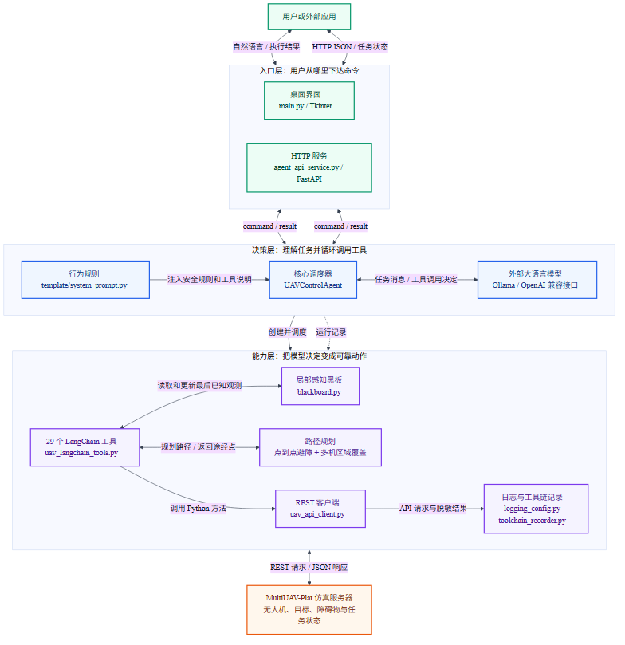
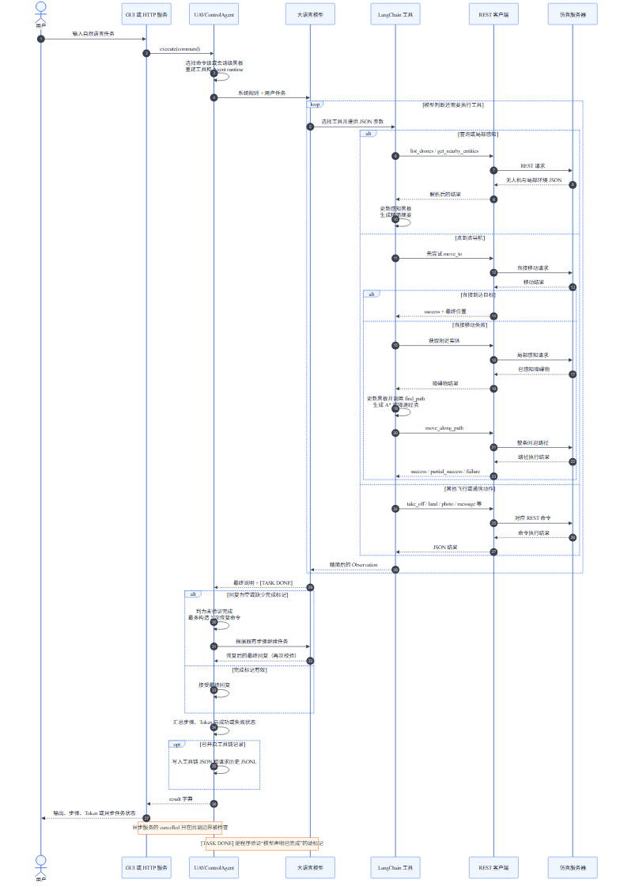

# Agent4Drone 零基础源码导读

> 适合读者：没有阅读源代码经验，但想知道“一句自然语言命令为什么能让多架无人机行动”的人。
>
> 阅读目标：读完后，你不需要记住每行 Python，但应该能说清楚一次命令经过了哪些模块、每个文件负责什么、路径规划怎样介入，以及这份代码目前有哪些边界。

## 1. 先用 30 秒建立整体印象

Agent4Drone 不是无人机本体，也不是仿真器。它更像一个“懂自然语言的任务调度员”，站在用户和 MultiUAV-Plat 仿真服务器之间：

1. 用户说：“让 1 号无人机起飞，去指定地点拍照。”
2. Agent4Drone 把任务和安全规则交给大语言模型。
3. 大语言模型不会直接控制无人机，而是选择 Agent4Drone 提供的工具，例如“列出无人机”“起飞”“导航”“拍照”。
4. 工具再通过 HTTP API 把命令送给仿真服务器。
5. 仿真服务器返回无人机状态、局部目标、障碍物或执行结果。
6. 大语言模型根据新结果继续选择工具，直到它给出带有 `[TASK DONE]` 的最终回复。

可以把它类比成：

- **用户**：任务委托人。
- **大语言模型**：负责理解和临场决策的调度员。
- **系统提示词**：调度员必须遵守的工作手册。
- **LangChain 工具**：调度员面前可以按下的 29 个操作按钮。
- **REST 客户端**：把按钮操作送到仿真服务器的通信员。
- **黑板**：记录最近看见的目标和障碍物的白板。
- **路径规划器**：发现直路不通时负责画绕行路线的导航员。
- **仿真服务器**：真正保存无人机、目标、障碍物和任务状态的世界。



图的 Mermaid 源码和可编辑版本位于：

- [agent4drone-architecture.mmd](../../figures/agent4drone-architecture.mmd)
- [agent4drone-architecture.md](../../figures/agent4drone-architecture.md)

## 2. 阅读代码前只需认识这些词

### 2.1 Python 文件、函数和类

- 一个 `.py` 文件通常叫作一个**模块**，可以把它看成一个按主题整理的工具箱。
- `def move_to(...):` 定义一个**函数**，类似一张写着输入、处理步骤和输出的工作卡。
- `class UAVControlAgent:` 定义一个**类**，类似某种机器的设计图；程序根据它创建真正运行的对象。
- `self.client` 表示“当前这个 Agent 对象自己的 REST 客户端”。
- `try / except` 表示“尝试执行；如果出错，就走错误处理路线”。

### 2.2 字典、JSON 和 API

Python 字典是一组“标签 → 内容”，例如：

```python
{
    "drone_id": "abc12345",
    "altitude": 15.0
}
```

JSON 是不同程序之间传递这种结构化数据的常用文本格式。API 可以理解为仿真服务器开设的一组固定业务窗口：

- `GET /drones`：查询无人机列表。
- `POST /drones/{id}/command/take_off`：命令某架无人机起飞。
- `GET /drones/{id}/nearby`：查询某架无人机局部可见的实体。

Agent4Drone 不直接修改仿真世界，而是按照这些固定窗口发出请求。

### 2.3 LLM Agent 和工具调用

这里的“Agent”不是一个永远正确的自动程序，而是“大语言模型 + 规则 + 可调用工具 + 循环执行器”的组合。

大语言模型每轮可以：

1. 根据任务和刚才的执行结果决定下一步；
2. 请求调用一个工具并给出 JSON 参数；
3. 阅读工具返回的 Observation；
4. 继续调用工具，或者输出最终答案。

LangChain 的 `create_agent(...)` 负责运行这个循环。项目代码负责提供模型、系统提示词和工具。

## 3. 目录地图与推荐阅读顺序

只看主流程时，可以先忽略测试和旧版实现：

```text
agent4drone/
├─ main.py                       桌面 GUI 入口
├─ agent_api_service.py          HTTP 服务入口
├─ uav_agent.py                  Agent 核心调度器
├─ template/
│  ├─ system_prompt.py           当前真正使用的系统规则
│  ├─ parsing_error.py           JSON 参数出错时的提醒
│  └─ agent_prompt.py            旧提示词模板，当前主流程未使用
├─ uav_langchain_tools.py        29 个模型可调用工具
├─ blackboard.py                 局部感知记忆
├─ path_planning/
│  ├─ path_finder.py             点到点避障
│  ├─ coverage_planner.py        单机/多机区域覆盖
│  ├─ visualizer.py              路径绘图辅助
│  └─ path_finder_original.py    旧版路径算法，用于对比演示
├─ uav_api_client.py             与仿真服务器通信
├─ toolchain_recorder.py         保存工具链和 API 请求历史
├─ logging_config.py             日志配置
└─ tests/                        自动化测试
```

推荐按下面的顺序读：

1. 本导读和两张图；
2. [template/system_prompt.py](../template/system_prompt.py)，看 Agent 被要求怎样工作；
3. [uav_agent.py](../uav_agent.py) 的 `UAVControlAgent.__init__` 和 `execute`；
4. [uav_langchain_tools.py](../uav_langchain_tools.py) 最后的工具列表，再挑一两个工具看；
5. [uav_api_client.py](../uav_api_client.py) 的 `_request` 和几个无人机操作；
6. 最后再看 [blackboard.py](../blackboard.py) 和 [path_planning](../path_planning/)。

不要从 `main.py` 第一行一路读到最后一行。它包含大量界面布局和可选语音输入代码，容易让初学者误以为这些就是 Agent 的核心。

## 4. 两个入口：同一个 Agent 的两扇门

### 4.1 桌面界面 `main.py`

[main.py](../main.py) 使用 Tkinter 创建本地窗口，主要负责：

- 读取和保存 `llm_settings.json`；
- 让用户选择模型服务和模型名称；
- 接收自然语言命令；
- 在后台线程中初始化和调用 `UAVControlAgent`，避免界面卡死；
- 展示最终回复、中间工具步骤、会话摘要和 Token 用量；
- 在依赖可用时提供语音输入。

它是“前台接待”，不负责路径规划或发送无人机 HTTP 请求。真正执行命令的关键调用仍然是：

```python
self.agent.execute(command, step_callback=...)
```

语音相关依赖采用可选导入：缺少语音识别、PyAudio、PyTorch 或 Transformers 时，界面仍能运行，只是语音功能不可用。

### 4.2 HTTP 服务 `agent_api_service.py`

[agent_api_service.py](../agent_api_service.py) 使用 FastAPI 把同一个 Agent 包装成网络服务。

主要接口是：

| 接口 | 作用 |
|---|---|
| `GET /health` | 查看 Agent 是否初始化成功 |
| `POST /agent/command` | 同步执行，调用者一直等待结果 |
| `POST /agent/command/async` | 创建异步任务并立即返回 `job_id` |
| `GET /agent/jobs/{job_id}` | 查询异步任务状态和结果 |
| `POST /agent/jobs/{job_id}/cancel` | 请求取消排队中或运行中的任务 |
| `GET /agent/session` | 获取面向人的会话摘要 |

服务启动时，`lifespan` 从 `llm_settings.json` 读取配置并创建全局 `agent_instance`。异步请求被保存在全局 `jobs` 字典里，经历：

```text
queued → running → completed / failed / cancelled
```

这里有一个容易误解的点：异步任务的 `completed` 表示“Agent 调用已经处理完”，不等于无人机任务必然成功。还要查看结果中的 `result.success`。

取消也是协作式的。`CancellationCallback` 会在 LangChain 开始模型、工具或链调用时检查状态；如果某个底层请求已经开始，取消不会像操作系统强制结束进程那样立刻中断它。

## 5. 核心大脑：`UAVControlAgent`

[uav_agent.py](../uav_agent.py) 是整个目录最重要的文件。可以把 `UAVControlAgent` 分成“初始化”和“执行一条命令”两部分。

### 5.1 初始化时装配六样东西

`UAVControlAgent.__init__` 依次完成：

1. 创建 `UAVAPIClient`，准备与仿真服务器通信；
2. 尝试读取当前仿真会话，连接失败时记录警告但继续初始化；
3. 根据配置创建 Ollama、OpenAI 或 OpenAI-compatible 模型；
4. 创建一块 `PerceptionBlackboard`；
5. 调用 `create_uav_tools(...)` 创建 29 个工具；
6. 用 `create_agent(model, tools, system_prompt)` 创建 LangChain Agent runtime。

模型供应商的差别主要在 `_create_llm`：

- `ollama` 使用本地 `ChatOllama`；
- `openai` 使用官方 OpenAI 地址或指定地址；
- `openai-compatible` 使用兼容 OpenAI Chat Completions 形式的第三方服务。

这层只统一模型调用方式，实际无人机工具不因模型供应商改变。

### 5.2 每条命令为何要重建黑板、工具和 runtime

`execute(command)` 开头会重新选择黑板，然后基于这块黑板重新创建工具和 Agent runtime：

```python
self.blackboard = self._blackboard_for_current_command()
self.tools = self._create_tools(self.blackboard)
self.agent = self._create_agent_runtime()
```

原因是工具闭包中保存着当前黑板对象。如果换了会话或命令，需要让新工具指向正确的记忆。

黑板有两种策略：

- `share_blackboard_by_session=False`（代码默认值）：每条命令获得一块新黑板，命令之间不保留局部观测。
- `share_blackboard_by_session=True`：同一个 `session_id` 重用同一块黑板；切换会话时自动换黑板。

示例配置把它设为 `true`，因此实际行为取决于 `llm_settings.json`。

### 5.3 `execute` 的真正执行循环

一次命令的核心过程是：

```text
创建 command_id
  ↓
准备黑板、工具、Agent 和回调
  ↓
调用 Agent（invoke 或 stream）
  ↓
模型调用工具，工具结果重新返回给模型
  ↓
提取最终回复、中间步骤和 Token
  ↓
检查步数上限、异常和 [TASK DONE]
  ↓
必要时恢复重试
  ↓
返回统一结果字典
```

返回结构大致是：

```python
{
    "success": True,
    "output": "最终回复 [TASK DONE]",
    "intermediate_steps": [...],
    "token_usage": {
        "prompt_tokens": ...,
        "completion_tokens": ...,
        "total_tokens": ...,
        "llm_calls": ...
    },
    "empty_response_retries": 0
}
```

项目把最大工具步骤设为 150。LangGraph 的递归上限被设成 `max(25, max_iterations * 3)`，因为一次工具步骤通常不只对应一个图节点。

### 5.4 为什么必须出现 `[TASK DONE]`

系统提示词要求最终回复以 `[TASK DONE]` 结尾，`_incomplete_output_reason` 又在程序层检查这个标记：

- 回复为空：判定失败；
- 有回复但没有 `[TASK DONE]`：仍判定失败；
- 回复为空且尚有重试机会：构造恢复命令，告诉模型不要重做已完成动作，而应从最后 Observation 继续。

空回复最多恢复两次。这个标记证明的是“模型明确声明任务已经结束”，不是仿真服务器的隐藏验证器已经判定任务通过。真正的 benchmark 任务是否通过，还要由平台任务进度或验证逻辑判断。

### 5.5 中间步骤和 Token 是怎样得到的

LangChain 消息中，模型发出的 `tool_calls` 与工具返回的 `tool_call_id` 是一一对应的。`_extract_intermediate_steps` 把它们整理成：

```text
(调用了哪个工具、输入是什么、模型当时的说明, 工具 Observation)
```

GUI、HTTP 响应和工具链记录器都能使用这种结构。

Token 用量可能出现在不同模型供应商的不同元数据字段中，所以代码提供多组提取和合并函数，并用 `ProviderTokenLoggingCallback` 记录每次模型调用。



图的 Mermaid 源码和可编辑版本位于：

- [agent4drone-command-flow.mmd](../../figures/agent4drone-command-flow.mmd)
- [agent4drone-command-flow.md](../../figures/agent4drone-command-flow.md)

## 6. 工作手册：`template/system_prompt.py`

[template/system_prompt.py](../template/system_prompt.py) 中的 `SYSTEM_PROMPT_TEMPLATE` 是当前 runtime 真正使用的系统提示词。

`build_system_prompt(tools)` 会遍历当前可用工具，把每个工具的名称和说明动态附加到提示词后面。因此模型同时得到：

- 必须先了解会话、列出无人机并进行局部感知；
- 应根据名称解析 8 字符实体 ID；
- 低电量、安全、障碍物和部分移动规则；
- 单点导航优先使用 `navigate_to`；
- 区域任务使用系统化覆盖路径；
- 黑板只保存最后已知观测，不能当作绝对实时真相；
- 带参数工具必须收到 JSON 字符串；
- 最终回复必须包含 `[TASK DONE]`；
- 当前所有工具的说明。

提示词不是普通注释，而是模型决策的重要运行输入。不过提示词只能“要求”模型遵守规则，不能像普通 Python 条件那样百分之百强制。项目因此还用步数上限、返回值检查和完成标记做程序级保护。

`template/parsing_error.py` 提供 JSON 格式错误后的提醒。

`template/agent_prompt.py` 中也有一份较旧的 ReAct 格式提示词，`template/__init__.py` 仍然导出它，但当前 `UAVControlAgent._create_agent_runtime()` 直接使用 `build_system_prompt`，所以不要把旧模板当成主流程。

## 7. 29 个工具：模型能按下哪些按钮

[uav_langchain_tools.py](../uav_langchain_tools.py) 使用 `@tool` 把普通 Python 函数包装成 LangChain 工具。模型看见的是工具名称、说明和一个 `input_json` 参数。

### 7.1 信息与感知

| 工具 | 作用 |
|---|---|
| `list_drones` | 列出无人机的状态、电量和位置 |
| `get_drone_status` | 查询一架无人机的详细状态 |
| `get_weather` | 查询天气 |
| `get_nearby_entities` | 查询一架无人机附近的实体，但不写黑板 |
| `sense_nearby_entities` | 查询一架或多架无人机，并把结果写入黑板 |
| `get_target_info` | 按目标 ID 获取详情 |
| `get_obstacle_info` | 按障碍物 ID 获取详情 |
| `update_blackboard_notes` | 给已知目标或障碍物添加任务备注和优先级 |

### 7.2 飞行、设备和通信

| 工具组 | 工具 |
|---|---|
| 基本飞行 | `take_off`、`land`、`move_to`、`move_towards`、`change_altitude`、`hover`、`rotate` |
| 返航与维护 | `return_home`、`set_home`、`calibrate`、`charge` |
| 任务动作 | `take_photo` |
| 多机通信 | `send_message`、`broadcast` |

### 7.3 导航和覆盖

| 工具 | 作用 |
|---|---|
| `navigate_to` | 精确坐标导航；直飞失败后进行一次感知和规划回退 |
| `move_along_path` | 执行显式途经点或缓存的覆盖路径 |
| `generate_coverage_path` | 为圆形或多边形区域生成多机覆盖计划 |

移动工具还有 `*_and_sense` 版本：

- `move_to_and_sense`
- `move_towards_and_sense`
- `navigate_to_and_sense`
- `move_along_path_and_sense`

它们在移动结束后立刻获取附近实体并更新黑板，减少“移动一次，再单独感知一次”的工具轮数。

### 7.4 为什么所有参数都包在 `input_json`

例如起飞工具希望收到：

```json
{"drone_id": "abc12345", "altitude": 15.0}
```

但工具函数对 LangChain 暴露的是一个字符串参数 `input_json`。函数内部再执行 `json.loads`，检查必填字段，并调用 REST 客户端。

这种写法统一了不同工具的参数入口，但也增加了模型生成嵌套 JSON 时出错的可能，所以每个工具都包含 JSON 解析错误提示。

### 7.5 工具为什么会压缩返回内容

附近实体、路径执行结果可能很大。如果把全部 JSON 每轮都交回模型，会增加 Token 消耗。代码中的 `_compact_drone`、`_compact_nearby`、`_compact_move_result` 等函数会保留决策所需字段，省略冗余细节。

部分工具支持：

```json
{"detail": "summary"}
```

或：

```json
{"detail": "full"}
```

默认使用精简结果。

## 8. 黑板：记住局部看见过什么

[blackboard.py](../blackboard.py) 的 `PerceptionBlackboard` 分别保存：

- `targets`：目标；
- `obstacles`：障碍物；
- `drones`：附近无人机。

`sense_nearby_entities` 获取局部观测后调用 `ingest_nearby`。黑板按实体 ID 判断是新发现还是更新，并把坐标、顶点等几何信息转换成规划器方便使用的元组。

黑板保存的是：

```text
实体 ID + 名称 + 类型 + 最近一次事实 + 可选备注 + 可选优先级
```

其中事实来自确定性的仿真 API；模型只能通过 `update_blackboard_notes` 写备注和优先级，不能用猜测覆盖位置、半径或顶点等事实。

`summary()` 返回适合模型阅读的精简内容，`full()` 返回完整事实。

最重要的限制是：黑板记录的是“最后一次看见时的情况”，不是持续自动更新的实时地图。无人机或环境发生变化后，Agent 需要再次感知。

## 9. 点到点避障：先直飞，再找绕行路线

点到点导航横跨两个文件：

- [uav_langchain_tools.py](../uav_langchain_tools.py) 的 `_navigate_to_destination` 负责导航工作流；
- [path_planning/path_finder.py](../path_planning/path_finder.py) 的 `find_path` 负责计算二维绕行路线。

### 9.1 `navigate_to` 的实际步骤

1. 查询无人机当前位置。
2. 如果与目标的二维距离不超过默认 1 米，直接报告已经到达。
3. 先调用一次服务器的 `move_to` 尝试直飞。
4. 如果服务器报告成功，并且最终位置确实在 1 米容差内，完成。
5. 如果直飞明确失败，获取一次附近实体并更新黑板。
6. 把黑板里的已知障碍物交给 `find_path`。
7. 将规划结果转换成带高度的途经点，调用一次 `move_along_path`，且不允许部分移动。
8. 再次检查最终位置和剩余距离。

如果服务器说直接移动成功，但实际位置没有到达目标，工具会返回失败，而不是继续规划。这样避免把含糊结果误当完成。

### 9.2 `find_path` 的直觉

规划器只处理平面上的 `(x, y)`：

1. 把点、圆、椭圆和多边形障碍物转换成 Shapely 几何形状。
2. 给障碍物加默认 1.1 米安全缓冲，相当于先把禁区“变胖”。
3. 如果起点或终点落在缓冲后的障碍物内，直接报错。
4. 如果起点到终点有无遮挡视线，返回直线。
5. 否则取障碍物凸包顶点，连接互相可见的点，形成“可见图”。
6. 在可见图上用 A* 搜索较短路线。
7. 如果障碍物顶点超过 40 个，或者可见图找不到路线，改用 2 米网格的 A*。
8. 对路线进行平滑，并按需要限制单段最大长度。导航工具使用 80 米作为最长路段。

A* 可以理解为“同时考虑已经走了多远，以及离终点大概还有多远”的寻路方法。

注意：这里只规划已知障碍物。无人机感知范围外的障碍物不会凭空出现在黑板中。

## 10. 区域覆盖：像割草一样来回扫描

[path_planning/coverage_planner.py](../path_planning/coverage_planner.py) 处理圆形或多边形区域。

单机覆盖的直觉是：

1. 按无人机的 `task_radius` 确定相邻扫描带间距；
2. 用一组水平线切过目标区域，得到多条有效扫描航道；
3. 相邻航道方向交替，形成“之”字形路线；
4. 从无人机当前位置连接到较近的入口端，减少空飞距离。

多机覆盖还会：

1. 把扫描航道切成与可用无人机数量相匹配的连续分区；
2. 估算不同无人机进入各分区的成本；
3. 为起点分配分区；
4. 为每架无人机生成自己的路线。

`generate_coverage_path` 工具不会把大量完整途经点都返回给模型。它把路径存入进程内的 `_COVERAGE_PLAN_CACHE`，只返回一个 `coverage_plan_id` 和路径摘要。模型随后让每架无人机调用：

```json
{
  "drone_id": "abc12345",
  "coverage_plan_id": "coverage-..."
}
```

`move_along_path` 再从缓存中取出这架无人机对应的完整路径。

## 11. REST 客户端：统一对接仿真服务器

[uav_api_client.py](../uav_api_client.py) 的 `UAVAPIClient` 是工具层和服务器之间的唯一标准通信入口。

每个公开方法都比较薄，例如：

```python
def take_off(self, drone_id, altitude=10.0):
    return self._request(
        "POST",
        f"/drones/{drone_id}/command/take_off",
        params={"altitude": altitude}
    )
```

真正公共的工作集中在 `_request`：

- 拼接服务器 URL；
- 添加可选的 `X-API-Key`；
- 使用默认连接/读取超时 `(5 秒, 60 秒)`；
- 记录请求方法、端点和参数，但不记录认证头和 API key；
- 发送 `requests.request(...)`；
- 对命令结果进行压缩和清理；
- 把 401 映射成认证失败，把 403 映射成权限不足；
- 把其他 HTTP 或网络错误转换成一致异常；
- 在工具链记录开启时保存经过脱敏的 API 调用。

它封装的接口分成无人机控制、会话、环境感知和碰撞检查四组。大多数控制和感知接口被包装成 LLM 工具，但并不是所有客户端方法都暴露给模型。

## 12. 日志、工具链和测试

### 12.1 普通日志

[logging_config.py](../logging_config.py) 创建带时间戳的日志文件和轮转处理器。`uav_agent.py`、`uav_api_client.py`、GUI 和 API 服务都通过统一 logger 记录事件。

日志关注：

- Agent 初始化；
- 命令开始、完成或失败；
- 使用了哪些工具；
- Token 用量；
- REST 端点和脱敏参数；
- 空回复、步数上限和异常。

### 12.2 可选工具链记录

当 `toolchain_json_recording=true` 时，[toolchain_recorder.py](../toolchain_recorder.py) 会保存：

- 原始命令和最终回复；
- 按顺序排列的工具调用和 Observation；
- Token 用量；
- 模型、会话和运行参数；
- 脱敏后的底层 API 请求与响应；
- 可供 UI 或重放工具使用的请求历史 JSONL。

写文件采用临时文件加原子替换，降低写到一半留下损坏 JSON 的风险。

### 12.3 测试是“可执行说明书”

[tests](../tests/) 中的测试按行为分组：

- `test_uav_api_client.py`：HTTP 参数、日志脱敏、超时和错误映射；
- `test_uav_langchain_tools.py`：工具是否正确调客户端、更新黑板、处理部分移动和缓存覆盖计划；
- `test_path_finder.py`：点、圆、椭圆、多边形障碍物及网格/途经点行为；
- `test_coverage_planner.py`、`test_coverage.py`：覆盖率、凹多边形、多机分配和路线长度；
- `test_token_usage.py`：Token 提取、空回复恢复、`[TASK DONE]`、黑板作用域和工具链记录；
- `test_agent_api_service.py`：配置读取、JSON 序列化和异步任务响应。

本次梳理没有安装依赖。当前激活的 Python 环境缺少 FastAPI、Shapely 和 LangChain，因此完整测试在收集阶段被依赖错误阻止；这不代表测试断言或业务逻辑失败。

在临时设置当前目录为 `PYTHONPATH` 后，底层客户端测试结果为：

```text
12 passed in 0.14s
```

项目所需依赖已经声明在仓库根目录的 `environment.yml` 中。

## 13. 四个完整例子

下面不追踪每个内部辅助函数，只追踪理解系统最重要的接力关系。

### 例 1：查询有哪些无人机

用户说：

> 现在有哪些无人机可以用？

可能的执行链：

```text
GUI/API 服务
→ UAVControlAgent.execute
→ 大语言模型选择 list_drones
→ 工具调用 UAVAPIClient.list_drones
→ GET /drones
→ 仿真服务器返回列表
→ 工具压缩无人机状态
→ 大语言模型组织答案
→ “…… [TASK DONE]”
```

这里不需要路径规划或黑板。

### 例 2：起飞并导航到坐标

用户说：

> 让 Drone 1 起飞到 15 米，然后飞到 `(100, 50)`。

理想工具链是：

1. `list_drones`：把名称解析成准确 ID，并检查状态和电量；
2. `sense_nearby_entities`：获得局部障碍物并更新黑板；
3. `take_off`：起飞到 15 米；
4. `navigate_to`：以当前高度前往 `(100, 50)`；
5. `get_drone_status`：必要时复核最终位置；
6. 最终回复并附 `[TASK DONE]`。

工具只是能力，真正的调用顺序由大语言模型根据系统提示词决定。

### 例 3：直飞被障碍物挡住

`navigate_to` 先调用 `move_to`。如果服务器明确返回失败：

```text
感知附近实体
→ 黑板记住障碍物
→ find_path 给障碍物加安全缓冲
→ 可见图 A* 或网格 A*
→ 得到绕行途经点
→ move_along_path 执行完整路线
→ 检查与目标点距离是否 ≤ 1 米
```

如果只完成部分途经点并返回 `partial_success`，导航工具不会把它当作到达终点。

### 例 4：多架无人机覆盖搜索区域

用户说：

> 用两架无人机搜索 Polygon Target 1。

可能的执行链：

1. 列出无人机并检查电量、状态和 `task_radius`；
2. 局部感知并把精确目标名称解析成目标 ID；
3. 调用 `generate_coverage_path(target_id, drone_ids)`；
4. 规划器生成扫描航道、分区并分配给两架无人机；
5. 工具缓存完整路线并返回 `coverage_plan_id`；
6. 每架无人机分别用自己的 ID 和同一个计划 ID 调用 `move_along_path`；
7. 检查任务状态，完成后输出 `[TASK DONE]`。

覆盖计划使用所选无人机中最小的正 `task_radius`，保证扫描间距不会超过能力较弱无人机的覆盖宽度。

## 14. 不要被这些源码细节迷惑

这些是当前代码的实际现状，不是本导读要顺手修改的问题。

### 14.1 `get_session_info` 被定义了，但模型实际拿不到

`uav_langchain_tools.py` 内部定义了 `get_session_info`，系统提示词又要求先检查会话状态，但函数末尾返回的 29 个工具列表没有包含它。

因此当前 LLM 工具集中没有 `get_session_info`。GUI/API 服务可以通过 `UAVControlAgent.get_session_summary()` 获取摘要，Agent 初始化也会读取会话上下文，但这些信息没有作为该工具暴露给模型。

### 14.2 `move_to` 的说明提到碰撞检查，但没有对应模型工具

`UAVAPIClient` 实现了 `check_point_collision` 和 `check_path_collision`，可是它们没有被 `create_uav_tools` 包装并返回。`move_to` 工具说明中的“先调用 `check_path_collision`”对当前模型来说无法直接完成。

实际安全主要依赖服务器拒绝非法移动，以及 `navigate_to` 在失败后感知并规划回退。

### 14.3 提示词中的“重规划”比单次工具实现更强

系统提示词说 `navigate_to` 会在部分移动或发现新障碍后重规划。当前 `_navigate_to_destination` 的内部行为是：

```text
一次直飞 → 一次感知和规划 → 一次路径回退
```

它自身没有循环重规划。大语言模型可以根据失败 Observation 再次调用导航工具，从系统层形成多轮重规划，但这不是单次 `navigate_to` 自动完成的。

### 14.4 旧文件不等于当前主流程

- `template/agent_prompt.py` 是旧提示词模板；
- `path_planning/path_finder_original.py` 是旧版算法，主要供演示脚本比较；
- `path_planning/visualizer.py` 用于测试和绘图，不参与正常飞行决策。

阅读时应以 `uav_agent.py` 的实际 import 和调用关系判断“谁在用谁”。

### 14.5 异步任务和覆盖计划都只存在内存

- `agent_api_service.py` 的 `jobs` 是进程内字典；
- `uav_langchain_tools.py` 的 `_COVERAGE_PLAN_CACHE` 也是进程内字典。

服务重启后，这些任务状态和覆盖计划都会消失，也没有跨多进程共享。

API 服务还共享同一个可变的 `agent_instance`，源码没有给同时执行的多个 Agent 命令加串行锁。这更适合作为参考实现或受控实验服务，而不是直接视为高并发生产系统。

### 14.6 “模型说完成”与“任务真实通过”是两回事

`[TASK DONE]` 只通过字符串检查。它能防止空回复或模型忘记给结束信号，但不能证明隐藏检查全部通过。评测时还需要读取平台的任务进度和验证结果。

## 15. 你现在应该记住的主线

如果只记住一条链路，请记住：

```text
用户命令
→ GUI 或 HTTP 服务
→ UAVControlAgent
→ 系统提示词约束下的大语言模型
→ 选择 LangChain 工具
→ 感知黑板 / 路径规划
→ UAVAPIClient
→ MultiUAV-Plat 仿真服务器
→ Observation 返回模型
→ 继续行动或输出 [TASK DONE]
```

Agent4Drone 的核心价值不是某一个路径算法，也不是某一个界面，而是把“语言理解、受限工具、局部感知记忆、路径规划、执行反馈和完成验证”组合成一个闭环。

下一步阅读源码时，建议先挑“查询无人机”这条最短链路，亲手在四个文件中跳转：

```text
uav_agent.py
→ uav_langchain_tools.py 的 list_drones
→ uav_api_client.py 的 list_drones
→ uav_api_client.py 的 _request
```

理解这条链以后，再读 `navigate_to` 和 `generate_coverage_path`，整个项目会容易很多。
