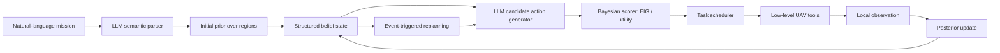

# 论文方案：面向部分可观测多无人机任务规划的贝叶斯信息寻求型 LLM Agent

**日期**：2026-07-27  
**阶段**：研究问题与第一阶段原型方案已冻结  
**目标用途**：指导后续平台最小改造、智能体框架实现、实验设计与论文写作  

## 1. 当前结论

当前研究不应定位为“修复 benchmark 失败场景”，也不应定位为“构建高保真无人机飞控仿真平台”。更合适的主线是：

> 在部分可观测、多无人机、工具受限任务中，显式 Bayesian belief 与信息增益驱动的探索决策，能否比普通 ReAct、无结构记忆 Agent 和规则搜索更可靠、更低成本地完成隐藏目标搜索与区域任务？

因此，benchmark 中的失败场景主要作为诊断来源和对照基线；真正的实验场景应围绕上述科研问题重新设计。当前 benchmark 可以提供任务模板、地图规模、无人机数量和基础验证接口，但不应反过来决定论文贡献。

## 2. 已冻结的研究定位

| 决策点 | 当前结论 |
|---|---|
| 核心问题 | 部分可观测多无人机任务中的信息寻求与任务执行决策 |
| 方法主线 | Bayesian information-seeking + structured belief + LLM task planning |
| 首个主场景 | 方向引导的隐藏目标搜索 |
| 平台角色 | 实验基础设施，不作为主要贡献 |
| LLM 角色 | 语义理解、候选策略生成、多 UAV 分工、失败解释与事件触发重规划 |
| Bayesian 模块角色 | 维护 posterior、计算 EIG / utility、选择信息收益高且代价合理的动作 |
| 底层规划器角色 | 短步移动、局部感知、几何避障、安全检查与任务 API 执行 |
| 主要对比对象 | 任务级 LLM Agent / 搜索决策方法，而不是 RRT*、MPC 或高保真飞控系统 |

推荐英文定位：

> Bayesian information-seeking LLM agents for language-guided multi-UAV mission planning under partial observability.

中文定位：

> 面向部分可观测多无人机任务规划的贝叶斯信息寻求型大模型智能体。

## 3. 主 Claim

**主 Claim**：

> 在局部感知、隐藏目标、多无人机协同任务中，显式 Bayesian belief 与信息增益驱动的探索决策，能够在相同低层工具下，相比 ReAct 和无结构记忆 Agent，提高目标发现率与任务成功率，并降低冗余搜索和 LLM 调用成本。

**最小可信证据**：

| 证据类型 | 需要证明什么 |
|---|---|
| 主结果 | 完整方法在隐藏目标搜索任务中优于 ReAct、规则搜索、无结构记忆和纯 Bayesian baseline |
| 消融实验 | 去掉 belief、去掉 EIG、去掉 LLM 候选生成、去掉事件触发重规划后性能下降 |
| 成本指标 | 成功率提升不是靠无节制增加 LLM 调用或搜索距离获得 |
| 部分可观测性检查 | Agent 不能访问全局目标坐标，收益来自局部观察融合与 posterior update |
| 失败分析 | 说明方法在哪些场景仍会失败，例如高障碍密度、错误观测、目标先验严重偏移 |

## 4. 参考论文思想如何迁移

参考论文：

> *Shoot First, Ask Questions Later? Building Rational Agents that Explore and Act Like People*，Gabriel Grand, Valerio Pepe, Jacob Andreas, Joshua B. Tenenbaum，ICLR 2026 / arXiv:2510.20886。

其核心思想不是简单的“问问题”，而是：

1. 显式维护隐藏状态的 belief；
2. 用 Bayesian update 整合观察；
3. 用 Expected Information Gain 选择探索动作；
4. 用一阶 lookahead 决定继续收集信息还是执行任务动作；
5. 让语言模型负责语义候选生成，而不是直接承担全部数值推理。

迁移到无人机任务后的对应关系：

| Collaborative Battleship | 多无人机任务规划 |
|---|---|
| hidden board | 隐藏目标位置、未知区域状态、未观测障碍 |
| Captain belief | 多 UAV 共享 belief map / target hypotheses |
| ask question | 派 UAV 到某区域感知、扫描或确认 |
| shoot tile | 前往目标点、拍照、覆盖、巡逻或完成任务 |
| yes/no answer | 局部传感返回：发现 / 未发现 / 障碍 / 目标类别 |
| Bayes-Q | 从候选搜索动作中选择信息收益最大的动作 |
| Bayes-M | 在 posterior 较高时选择任务执行动作 |
| Bayes-D | 决定当前应探索还是执行 |

## 5. 核心场景设计

第一阶段主场景建议固定为：

> 方向引导的隐藏目标搜索。

示例任务：

> “派无人机向东北方向搜索物品 A，发现后靠近并拍照确认，同时避免重复搜索和不必要的重规划。”

场景关键约束：

| 维度 | 设计 |
|---|---|
| 目标坐标 | 对 Agent 隐藏，只在局部感知半径内可被发现 |
| 用户指令 | 给自然语言方向、区域、类别或弱先验，不给精确坐标 |
| 感知方式 | 每次短步移动后调用局部感知 |
| 多 UAV | 需要分配搜索扇区、避免重复覆盖、共享发现 |
| 障碍物 | 先使用平台简化障碍模型，加入安全半径作为可信性补丁 |
| 成功条件 | 发现目标、到达任务半径内、拍照或完成对应任务检查 |

后续可从该主场景扩展：

| 扩展场景 | 用途 |
|---|---|
| 多隐藏目标搜索 | 验证任务分配与 shared memory |
| 干扰目标 / 相似目标 | 验证语义确认与错误观测恢复 |
| 动态任务插入 | 验证事件触发重规划 |
| UAV 故障 / 电量不足 | 验证任务转移 |
| 通信受限 | 验证共享记忆和局部决策的鲁棒性 |

## 6. 方法框架

推荐总体结构：



### 6.1 Structured Belief

不要只依赖 LLM 上下文记忆，应维护显式 belief：

```json
{
  "target_hypotheses": [
    {
      "region_id": "NE-01",
      "probability": 0.42,
      "last_observed_step": 8,
      "assigned_uav": "drone_2"
    }
  ],
  "searched_regions": [],
  "known_obstacles": [],
  "uav_states": [],
  "task_status": "searching"
}
```

### 6.2 Posterior Update

将搜索空间离散为 grid 或 semantic region。每个区域维护目标存在概率：

```text
b_t(g) = P(target in region g | observations up to t)
```

每次 UAV 执行搜索动作后，根据感知结果更新：

```text
b_{t+1}(g) ∝ P(o_t | target in g, action_t) * b_t(g)
```

第一阶段不做连续空间复杂 Bayes filter，先用离散区域或粒子近似。

### 6.3 Expected Information Gain

对候选搜索动作计算近似信息增益：

```text
EIG(a) = H(b_t) - E_o[H(update(b_t, a, o))]
```

实际动作选择使用 utility：

```text
U(a) = alpha * EIG(a)
     + beta * P_success(a)
     - lambda_d * travel_cost(a)
     - lambda_r * redundancy(a)
     - lambda_s * safety_risk(a)
     - lambda_l * LLM_cost(a)
```

### 6.4 LLM 的边界

LLM 不直接计算概率表，也不直接做几何避障。它主要负责：

1. 解析自然语言任务中的方向、目标类别、优先级和约束；
2. 根据 belief 摘要生成候选搜索意图；
3. 在多 UAV 间进行任务分配解释；
4. 在 blocked path、low battery、target found、contradictory observation 等事件出现时触发高层重规划；
5. 生成可审计的决策理由，便于 episode trace 和论文分析。

## 7. 平台最小改造

当前 MultiUAV-Plat / Agent4Drone 更接近任务级仿真，而不是高保真飞控仿真。为了支撑论文有效性，平台只做最小必要增强：

| 优先级 | 改造项 | 目的 |
|---|---|---|
| P0 | 局部感知隔离 | 防止 Agent 通过工具获得隐藏目标全局坐标 |
| P0 | `step_move` 或固定短步移动 | 支持 `move -> sense -> update belief -> replan` 闭环 |
| P0 | 隐藏目标任务生成器 | 构造真正需要主动探索的任务 |
| P0 | episode trace | 记录 prompt、tool call、observation、belief、action、result |
| P0 | safety radius / obstacle inflation | 避免明显不可信的贴障、穿障结果 |
| P1 | 候选区域生成与覆盖统计 | 支持 EIG、冗余搜索和覆盖率评估 |
| P1 | 多 seed 批量评测 | 支持统计对比 |
| P2 | 通信受限、故障、电量扰动 | 作为后续扩展，不进入第一阶段主线 |

暂不作为第一阶段目标：

1. 真实旋翼尺寸与刚体碰撞；
2. 连续动力学与姿态控制；
3. MPC / RRT* 作为论文主贡献；
4. Gazebo、AirSim、Isaac Sim 接入；
5. 高精度 3D mesh collision。

## 8. Benchmark 的使用方式

当前 benchmark 的价值：

| 用法 | 是否作为主贡献 | 说明 |
|---|---|---|
| 复用任务模板 | 是，作为实验基础 | Target Assignment、Area Search、Area Assignment and Patrol 可作为任务原型 |
| 分析失败场景 | 是，作为诊断 | 识别 ReAct 在隐藏目标、重规划、冗余搜索上的失败模式 |
| 追求 benchmark 总分 | 否 | 容易变成工程调参，不能支撑清晰科研问题 |
| 高保真飞控评估 | 否 | 平台抽象层级不适合支撑该 claim |

建议从 Area Search Intermediate / Hard 中抽象出新任务族：

> Hidden Directional Area Search。

其区别是：目标坐标隐藏、局部感知严格隔离、动作以短步闭环执行、每一步更新 belief。

## 9. Baseline 与消融

### 9.1 Baseline

| 系统 | 目的 |
|---|---|
| Rule-based sweep | 测试简单规则覆盖搜索的下限 |
| ReAct LLM Agent | 当前最直接的 LLM agent baseline |
| LLM + unstructured history | 验证仅靠聊天历史是否足够 |
| LLM + structured memory | 验证结构化记忆本身的收益 |
| Bayesian search without LLM | 验证纯数值搜索是否缺乏语义泛化 |
| Full method | LLM candidate generation + Bayesian EIG scoring + structured belief + event-triggered replanning |

### 9.2 消融实验

| 消融 | 要回答的问题 |
|---|---|
| w/o structured belief | 性能提升是否来自显式状态，而不是 prompt 技巧 |
| w/o EIG | 信息增益是否真的影响搜索效率 |
| w/o LLM candidate generation | LLM 是否提供了语义候选生成价值 |
| w/o shared memory | 多 UAV 共享信息是否降低重复搜索 |
| w/o event-triggered replanning | 事件触发机制是否减少无效 LLM 调用 |
| random candidate selection | Bayesian scorer 是否优于随机或贪心选择 |

## 10. 指标

| 指标 | 解释 |
|---|---|
| Discovery Rate | 目标被发现的比例 |
| Task Success Rate | 最终任务完成比例 |
| Time to Discovery | 发现目标所需步数或仿真时间 |
| Search Distance | 总飞行距离 |
| Coverage Redundancy | 多 UAV 重复搜索比例 |
| LLM Calls | 高层 LLM 调用次数 |
| Token Cost | 任务级决策成本 |
| Replanning Efficiency | 有效重规划次数 / 总重规划次数 |
| Collision / Safety Violation Rate | 简化安全模型下的违规比例 |
| Belief Calibration | posterior 高概率区域与真实目标分布的一致性 |

## 11. 实验路线

| 阶段 | 目标 | 运行内容 | Go / No-Go 标准 |
|---|---|---|---|
| M0 Sanity | 验证闭环接口和指标正确 | 单 UAV、单目标、无障碍、固定方向先验 | Oracle 能接近 100% 发现目标 |
| M1 Baseline | 建立可比较基线 | Rule sweep、ReAct、structured memory | baseline 能稳定跑完整 episode |
| M2 Main Method | 跑完整方法 | 多 UAV、隐藏目标、局部感知、EIG 选择 | Discovery / Success 明显优于 ReAct |
| M3 Ablation | 验证核心机制 | 去掉 belief、EIG、LLM 候选生成、shared memory | 关键模块删除后出现可解释下降 |
| M4 Robustness | 扩展难度 | 改变 UAV 数量、感知半径、障碍密度、目标先验偏差 | 趋势符合部分可观测任务直觉 |
| M5 Analysis | 写论文分析 | 典型轨迹、belief heatmap、失败案例 | 能解释成功和失败原因 |

第一阶段推荐参数：

| 参数 | 候选值 |
|---|---|
| Seeds | 0, 1, 2 |
| UAV 数量 | 1, 3, 5 |
| 感知半径 | 25, 50, 100 |
| 移动步长 | 10, 25, 50 |
| 障碍密度 | low, medium |
| 目标先验 | accurate, shifted, weak |

## 12. 第一阶段原型范围

第一阶段只需跑通以下闭环：

```text
自然语言任务
-> 初始化目标先验 belief
-> 多 UAV 候选搜索动作
-> 计算每个动作的 EIG / utility
-> 选择动作并短步执行
-> 局部感知
-> posterior update
-> 发现目标后执行确认任务
-> 记录 episode trace
```

暂不做复杂扩展：

1. 大规模任务库；
2. 动态障碍；
3. 通信受限；
4. 复杂 failure recovery；
5. 端到端论文级可视化；
6. 高保真物理仿真。

## 13. 论文结构草案

### 1 Introduction

核心叙事：

1. LLM Agent 在无人机任务中有语义理解和任务分解优势；
2. 但在部分可观测任务中，普通 ReAct 往往缺少可验证的不确定性管理；
3. 多无人机隐藏目标搜索需要主动探索、共享记忆和探索/执行权衡；
4. 本文提出 Bayesian information-seeking LLM Agent，在任务级仿真中验证该机制。

### 2 Related Work

候选分类：

1. LLM agents for embodied / robotic planning；
2. Multi-UAV mission planning and coordination；
3. Active perception and information gain planning；
4. Bayesian experimental design / information-seeking language agents；
5. UAV benchmarks and simulators for LLM agents。

注意：相关工作需后续系统检索并核验，不能只凭记忆写引用。

### 3 Problem Formulation

定义部分可观测多 UAV 任务：

```text
s_t: environment state
o_t^i: local observation of UAV i
b_t: shared belief state
a_t^i: UAV action
G: natural-language mission goal
```

### 4 Method

介绍：

1. language-conditioned prior construction；
2. structured belief representation；
3. LLM candidate action generation；
4. Bayesian EIG / utility scorer；
5. multi-UAV assignment and event-triggered replanning。

### 5 Experiments

主表：

| Method | Discovery | Success | Distance | Redundancy | LLM Calls | Token Cost |
|---|---|---|---|---|---|---|
| Rule sweep | TBD | TBD | TBD | TBD | TBD | TBD |
| ReAct | TBD | TBD | TBD | TBD | TBD | TBD |
| Structured memory | TBD | TBD | TBD | TBD | TBD | TBD |
| Bayesian only | TBD | TBD | TBD | TBD | TBD | TBD |
| Ours | TBD | TBD | TBD | TBD | TBD | TBD |

### 6 Analysis

展示：

1. belief heatmap 随时间变化；
2. 多 UAV 搜索轨迹；
3. ReAct 失败案例；
4. EIG 选择动作的可解释样例；
5. 高障碍密度或错误先验下的失败。

### 7 Limitations

应主动承认：

1. 平台是 mission-level simulator，不是高保真飞控平台；
2. 碰撞模型是简化的 point / line safety check；
3. 第一阶段目标是任务级不确定性决策，不验证真实动力学控制；
4. 语义感知依赖场景中已定义的目标对象，不等价于真实视觉识别。

## 14. 风险与应对

| 风险 | 应对 |
|---|---|
| 被认为只是 prompt engineering | 核心模块必须有显式 posterior update 和 EIG 计算 |
| 被认为信息泄漏 | 严格区分 ground truth 与 agent observation |
| 被认为只是规则搜索 | 加入自然语言先验、LLM 候选生成、语义约束和复杂任务变化 |
| 被控制/导航审稿人攻击 | 明确定位为 mission-level decision making，不声称 autonomous flight control |
| 实验收益来自更多调用成本 | 同时报告 LLM calls、token cost、search distance |
| 多 UAV 优势不明显 | 设计目标密度、感知半径和区域大小，使协同确有必要 |
| Bayesian 模块过弱 | 至少实现离散 posterior、观测模型、EIG 和 utility，而不是 LLM 自评置信度 |

## 15. 下一步执行清单

### P0：代码与平台

- [ ] 检查现有工具是否存在严格局部感知接口；
- [ ] 增加或封装 `step_move`；
- [ ] 设计 hidden target task generator；
- [ ] 实现 grid / region belief map；
- [ ] 实现 posterior update；
- [ ] 实现 EIG / utility scorer；
- [ ] 增加 episode trace 日志；
- [ ] 增加简化 safety radius；
- [ ] 跑通单 UAV toy case。

### P1：智能体

- [ ] 实现 ReAct baseline；
- [ ] 实现 structured memory baseline；
- [ ] 实现 Bayesian-only baseline；
- [ ] 实现 LLM candidate generation；
- [ ] 实现完整方法；
- [ ] 加入事件触发重规划。

### P2：实验

- [ ] 跑 M0 sanity；
- [ ] 跑 M1 baseline；
- [ ] 跑 M2 main method；
- [ ] 跑 M3 ablation；
- [ ] 汇总主表；
- [ ] 生成 belief heatmap 和轨迹图；
- [ ] 写失败分析。

## 16. 当前最重要的工程判断

优先级应是：

```text
先改出可信闭环任务
-> 再实现显式 belief + EIG 决策
-> 再跑 baseline 和消融
-> 最后扩展 benchmark 难度
```

不要先大规模重写平台，也不要先追求 3D 可视化或高保真避障。第一篇论文的核心不是“无人机怎么飞得更真实”，而是“在信息不完整时，LLM Agent 如何更理性地决定探索与执行”。

